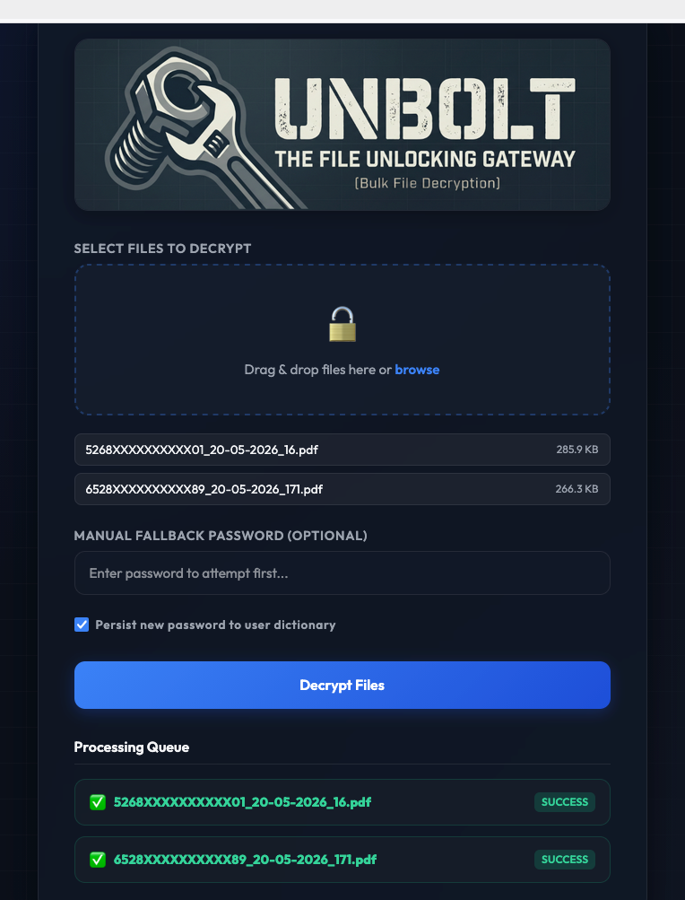

# UNBOLT: The File Unlocking Gateway 🔓

An extremely lightweight, extensible, and clean bulk file decryption utility built with Python, FastAPI, and `pikepdf`. Designed to allow rapid parallel decryption of password-protected documents entirely in-memory.

<p align="center">
  
</p>

---

> [!WARNING]
> **Security Advisory:**
> UNBOLT does not feature any built-in user authentication or access controls. Because it processes and stores decryption passwords in dictionaries on the host machine, **you should only run this utility inside a secure local network (LAN) or protect it behind an authentication layer** (such as Authelia, Cloudflare Access, or a basic auth reverse proxy).

---

## ⚡ Key Features

- **Parallel Decryption:** Feeds multiple uploaded files asynchronously to the backend using native browser parallel fetches.
- **Deduplicated Password Matching:** Automatically tries a user-supplied fallback password first, then scans through shared and user-contributed dictionaries.
- **In-Memory Streams:** Files are decrypted entirely within memory buffers, preventing temporary file leakage on disk.
- **Modular Routing Registry:** Handlers are mapped dynamically based on extensions. Adding support for new file formats (like `.zip` or `.xlsx`) is as simple as writing a function decorated with `@register_decrypter`.
- **Modern Dark UI:** Includes a beautiful drag-and-drop dashboard complete with real-time queue state indicators and instant download triggers.

---

## 🛠️ Architecture Notes

This application is mostly **vibe-coded**, engineered to solve bulk-decryption pipelines quickly and dynamically.

- **PDF Decryption:** Handled using `pikepdf` (direct bindings to `qpdf`) to avoid external CLI wrapper overhead.
- **Zip / Office Stubs:** Registered as stubs (`NotImplementedError`) ready for dependency inclusion if needed.
- **Lock Guardrails:** Writes to the user dictionary file (`user_passwords.txt`) are protected by a thread lock (`threading.Lock`) to prevent race conditions during parallel processing.

---

## 🚀 Running the App

### 1. Using the Prebuilt Container (Recommended)

You can run UNBOLT directly using the prebuilt image hosted on GitHub Container Registry without needing to clone or build the source code.

#### Via Docker Compose
Create a `docker-compose.yml` file:
```yaml
version: '3.8'

services:
  decrypter:
    image: ghcr.io/antimatt3r/unbolt:latest
    ports:
      - "8000:8000"
    volumes:
      - ./data:/data
    restart: unless-stopped
```
Ensure you have a `./data` directory relative to the compose file containing your password dictionary files (e.g., `primary_passwords.txt`), then run:
```bash
docker-compose up -d
```

#### Via Docker CLI
Run the following command directly:
```bash
docker run -d \
  -p 8000:8000 \
  -v $(pwd)/data:/data \
  ghcr.io/antimatt3r/unbolt:latest
```

---

### 2. Building and Running from Source

#### Via Docker Compose
1. Clone this repository.
2. Place your dictionary passwords in `./data/primary_passwords.txt` (one per line).
3. Set your configurations in `.env`:
   ```env
   HOST_PORT=8000
   HOST_DATA_PATH=./data
   ```
4. Run:
   ```bash
   docker-compose up -d --build
   ```

#### Via Docker CLI
To build and run without Docker Compose:
```bash
# Build the image locally
docker build -t unbolt .

# Run the container mapping host port 8000 and binding host directory to /data
docker run -d \
  -p 8000:8000 \
  -v $(pwd)/data:/data \
  unbolt
```

---

## 📁 Password Storage Structure

Inside the mounted `/data` directory:
- `primary_passwords.txt`: Read-only base dictionary used for decryption attempts.
- `user_passwords.txt`: Fallback dictionary. If a manual password succeeds and is not already indexed, it is optionally written here for future automatic runs.

---

## 💻 CLI Tool (`unbolt.py`)

A standalone Python script `unbolt.py` is included in the root directory for bulk decryption directly from your terminal. It executes concurrent parallel requests to your designated server API and has **zero third-party dependencies** (uses only standard library packages).

### Setup and Configuration
By default, the script looks for `UNBOLT_URL` in a `.env` file (checking the current working directory, then the script's directory).

Add it to your `.env` or set it in your environment:
```env
UNBOLT_URL=http://localhost:8000
# Or pointing to your public instance
# UNBOLT_URL=https://unbolt.example.com
```

### Usage
Run decryption on files (supports relative and absolute paths):
```bash
./unbolt.py file1.pdf file2.pdf
```

### Options
* `-p`, `--password`: Provide a manual fallback password to try first.
* `-f`, `--force`: Overwrite existing output files (by default, the tool performs a precheck conflict scan and aborts if output files already exist).
* `-u`, `--url`: Manually override the target API URL.

**Example with manual password and forced overwrite:**
```bash
./unbolt.py -p "mySecretPassword" -f ~/Documents/secure_file.pdf
```
